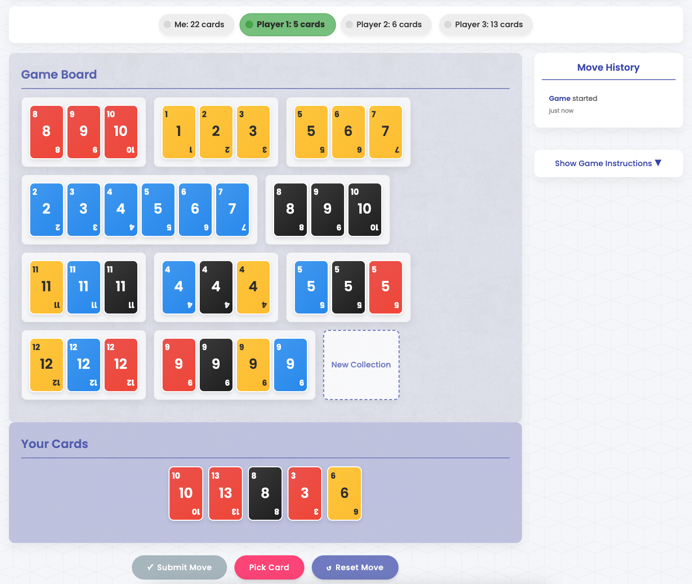

# Rummikub Agent

Play Rummikub against computer agents. This project implements the classic tile-based game Rummikub with AI players following different policies.

## Game Overview

Rummikub is a strategic tile-based game where players compete to be the first to empty their rack of tiles. Players create and manipulate groups (same number, different colors) and runs (sequential numbers of the same color) on the board. Strategic thinking is required to rearrange existing tiles on the board to make new valid combinations. This implementation features an advanced agent powered by Integer Linear Programming (ILP) optimization, which calculates optimal moves by solving combinatorial problems.



## Installation

1. Clone this repository:
```bash
git clone https://github.com/usserwout/rummikubAgent.git
cd rummikubAgent
```

2. Install required dependencies:
```bash
pip install -r requirements.txt
```

## Usage

### Starting a game

Run the main script to start a game:

```bash
python main.py
```

This will start a game with one manual player (you) and three opponents.

### Web Interface

When using the manual policy, a web interface will be available at http://localhost:5001 that allows you to interact with the game.

